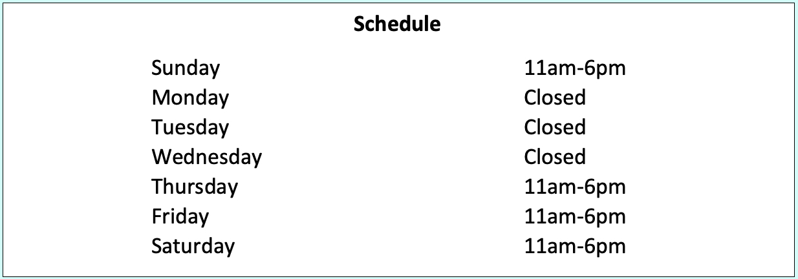
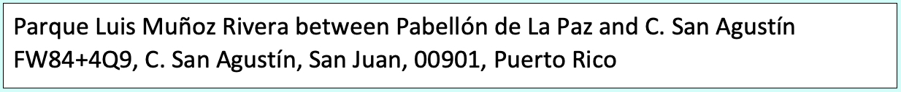

```{r setup, include=FALSE}
knitr::opts_chunk$set(echo = TRUE)
```

```{r, echo=FALSE}
#
```

<center>
  <font size="18">
    <b><i> Sueño D'ielo Gourmet Shave Ice </i> </b> 
  </font>
</center>

<center>
  <font size="18">
    Official Website Coming Soon
  </font>
</center>






```{r pressure, echo=FALSE}

```

